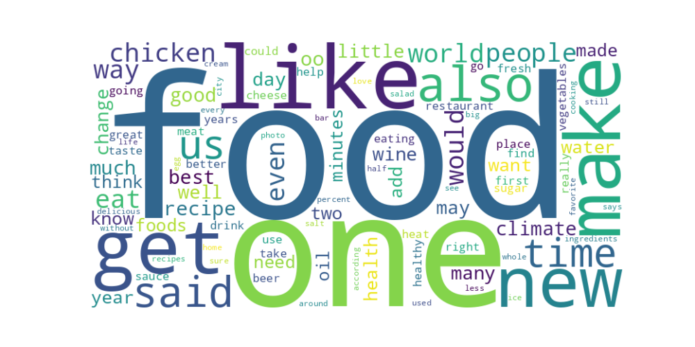

# Article Similarity Analysis

<p align="center">
  
</p>

This project aims to analyze the similarity between articles based on their content using different techniques such as TF-IDF and LDA. The dataset consists of articles from various topics, and the goal is to identify related articles based on their content. The analysis is performed for two topics: "Food and Drink" and "Sports."

## Setup

1. Clone the repository:

```bash
git clone git@github.com:ikajdan/article_similarity_analysis.git
cd article_similarity_analysis
```

2. Create and activate a virtual environment:

```bash
python -m venv .venv
source .venv/bin/activate
```

3. Install the required packages:

```bash
pip install -r requirements.txt
```

## Task 1

<details>
  <summary>Task Description</summary><br>

  Implement the following pseudocode to calculate the variable ratio_quality using the TFIDF vectors. Measure the execution times separately for the following two subprocesses:
  - Creating the model (from the program begin to the call similarities.MatrixSimilarity(tfidf_vectors))
  - Implementation of the pseudocode above.

```
total_goods = 0

For every article (a) on topic "Food and Drink":

   Obtain the top-10 most similar articles (top-10) in Corpus to a

   Count how many articles in top-10 are related to topic "Food and Drink" (goods)

   total_goods = total_goods + goods

ratio_quality = total_goods/(num_articles_food_and_drink*10)
```
</details>

---

Creation of the TF-IDF model took 7.3811 seconds, and the quality ratio calculation took 72.9012 seconds. The quality ratio for the topic "Food and Related" was 0.39. The quality ratio is calculated by counting how many articles in the top-10 most similar articles are related to the topic "Food and Drink" and dividing it by the total number of articles related to "Food and Drink" multiplied by 10.

- TF-IDF model creation time: 7.5356 seconds
- Quality ratio for 'Food and Drinks': 0.388 (in 79.0590 seconds)

## Task 2

<details>
  <summary>Task Description</summary><br>

  Repeat the previous task with LDA vectors and compare the results. Explain the differences in the results. Use 30 topics, two passes, and a random state parameter.
</details>

---

TF-IDF focuses on word frequency and gives more weight to terms that appear frequently in a document but less frequently across the corpus. On the other hand, LDA discovers latent topics in documents and represents documents in a probabilistic space of topics. Therefore, TF-IDF will likely perform better for tasks that are directly related to word matching. LDA might capture hidden relationships between words (topics) and could potentially identify relevant articles that don’t explicitly mention the related words (in this case food and drink), but are still thematically related.

- TF-IDF model creation time: 7.2878 seconds
- LDA model creation time: 52.2442 seconds
- TF-IDF quality ratio for 'Food and Drinks': 0.388 (in 72.6243 seconds)
- LDA quality ratio for 'Food and Drinks': 0.329 (in 11.3164 seconds)

## Task 3

<details>
  <summary>Task Description</summary><br>

  Repeat the previous two tasks but with the topic "Sports" and compare the results. Why do you think that the quality of the results is worse than the ones obtained with the topic "Food and Drink"?
</details>

---

The quality of the results for the topic "Sports" is worse than the ones obtained with the topic "Food and Drink" because the articles related to sports are likely to be more diverse and cover a wider range of topics compared to the articles related to food and drink. This diversity makes it harder for the algorithms to identify relevant articles based on the similarity of their content. The topic "Food and Drink" is more specific and has a narrower focus, making it easier for the algorithms to identify related articles.

- TF-IDF model creation time: 7.1060 seconds
- LDA model creation time: 51.6410 seconds
- TF-IDF quality ratio for 'Sport': 0.358 (in 98.7607 seconds)
- LDA quality ratio for 'Sport': 0.259 (in 19.3900 seconds)

## Task 4

<details>
  <summary>Task Description</summary><br>

  Explain how you can get better results comparing articles by resorting to tagging. Propose a method to calculate the similarity between two articles using their associated tags. Note that the articles in the data set are tagged.
</details>

---

## Tag-Based Similarity

Instead of calculating the similarity based on the content of the articles, we can calculate the similarity based on the tags associated with the articles. This approach can help capture the thematic similarity between articles based on the tags assigned to them, which can be more informative than just comparing the content of the articles.

- TF-IDF model creation time: 0.5012 seconds
- Quality ratio for 'Food and Drinks': 0.696 (in 3.4070 seconds)

### Cosine Similarity

One way to do this is to represent the tags as vectors and calculate the cosine similarity between the tag vectors of two articles. The tags can be converted into a numerical representation using techniques like one-hot encoding or word embeddings. Once the tags are represented as vectors, we can calculate the cosine similarity between the tag vectors of two articles to measure their similarity based on the tags.

### Jaccard Similarity

Another approach is to use Jaccard similarity to compare the tags of two articles. Jaccard similarity measures the similarity between two sets by calculating the intersection over the union of the sets. In this case, the tags associated with the articles can be treated as sets, and the Jaccard similarity can be calculated between the tag sets of two articles to measure their similarity based on the tags.

## Further Improvements

The quality of the results can be further improved by choosing more keywords that are specific to the topic of interest. That way we can increase the chances of identifying related articles accurately.

For the previous tasks, only two keywords were used to filter the articles related to the topics "Food and Drink" (food, drink), and "Sports" (sports, game). By using a more extensive list of keywords that are specific to the topics, we can improve the quality of the results.

The script word_frequency.py was used to calculate the frequency of words in the dataset. It extracts articles related to the topic, and counts the frequency of words in those articles.

The top 50 most frequent words in the dataset for the "food" and "drink" are as follows: food (488), one (307), like (305), make (230), get (222), new (220), also (217), said (196), time (171), us (169), people (163), way (160), would (157), eat (157), chicken (154), even (152), world (149), recipe (145), oo (145), good (139), best (136), climate (132), much (130), change (124), wine (122), many (120), little (117), day (115), may (115), well (113), want (108), two (108), health (107), add (106), know (104), year (104), water (104), oil (100), need (99), made (99), minutes (98), foods (97), think (97), restaurant (97), beer (97), first (96), place (96), take (95), fresh (94), could (94).

The top 50 most frequent words in the dataset for the "sport" and "game" are as follows: one (251), said (236), game (231), would (227), team (219), sports (214), time (200), new (197), like (188), world (186), people (176), games (157), also (155), first (155), oo (145), us (141), players (132), many (131), year (125), get (122), could (119), years (119), two (112), season (111), climate (111), play (107), make (107), women (107), even (106), football (104), change (103), back (103), much (94), well (94), university (92), athletes (91), told (87), fans (87), take (86), last (84), going (84), baseball (84), made (83), know (82), think (81), nfl (81), may (79), league (79), really (78), nba (77).

The words were then hand-picked to create a list of keywords that are more specific to the topics "Food and Drink":

```python
RELATED_WORDS_FOOD = [
    "food",
    "drink",
    "eat",
    "chicken",
    "recipe",
]
```

and "Sports":

```python
RELATED_WORDS_SPORTS = [
    "game",
    "team",
    "sports",
    "players",
    "football",
]
```
